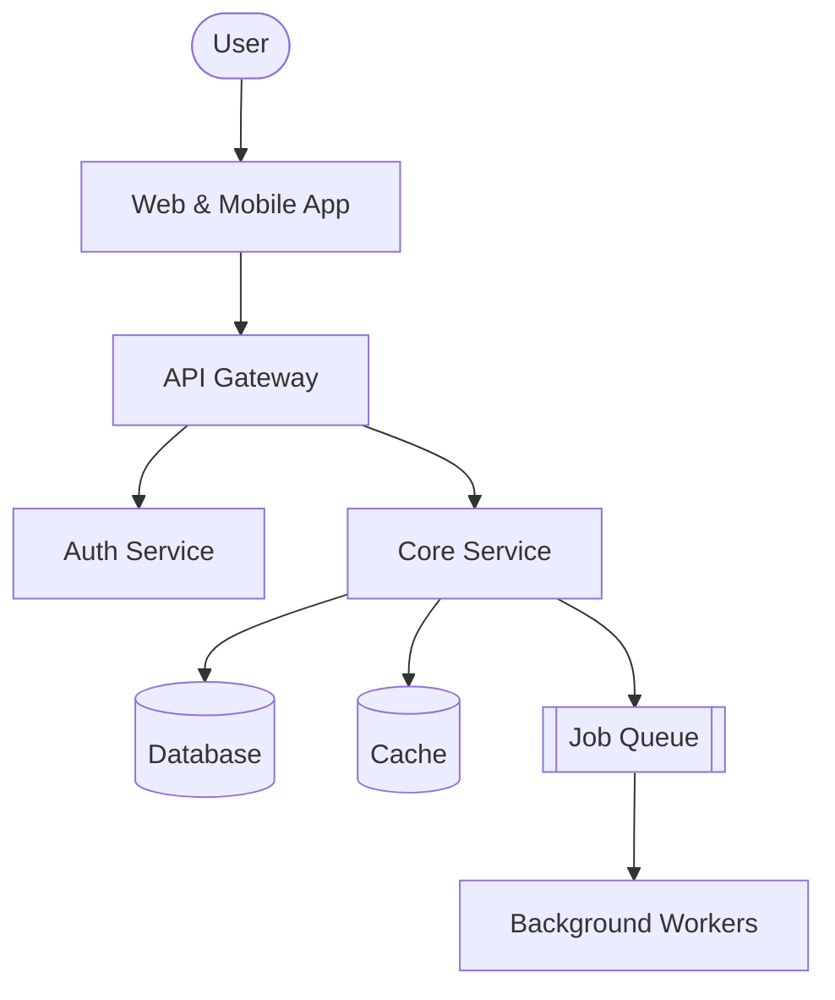
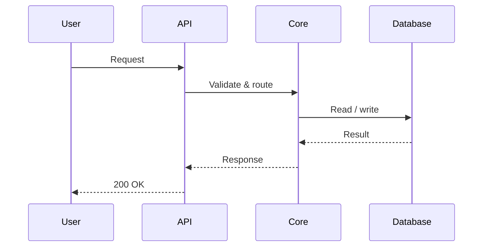

# System Design — Project Name

> One-line summary of what this system does and who it is for.

## Architecture

## Request Flow

## Components

| Component    | Responsibility             |
| ------------ | -------------------------- |
| API Gateway  | Routing, auth, rate limits |
| Core Service | Business logic             |
| Database     | Source of truth            |
| Cache        | Fast reads                 |
| Workers      | Async / scheduled jobs     |

## Open Questions

- [ ] Scaling strategy for peak load?
- [ ] Data retention & backup policy?
- [ ] Monitoring & alerting plan?

> **Tip:** tap any diagram above to edit it in the Mermaid Studio.
